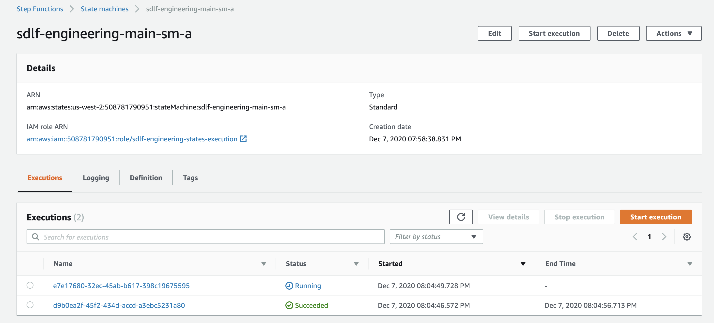

# terraform-aws-serverless-datalake-framework
codebase for deploying the aws sdlf via terraform

## modules
- sdlf-foundations: shared and foundational infrastructure for the data lake (deployed once) / [readme](./modules/sdlf-foundations/readme.md)
- sdlf-team: infrastructure for a team within the datalake / [readme](./modules/sdlf-team/readme.md)
- sdlf-pipeline: infrastructure for a pipeline for a team / [readme](./modules/sdlf-pipeline/readme.md)
- sdlf-dataset: infrastructure for a dataset for a pipeline / [readme](./modules/sdlf-dataset/readme.md)
- sdlf-dataset-job: wrapper module to create a dataset glue job / [readme](./modules/sdlf-dataset-job/readme.md)

## deployment

### foundations
#### prerequisites
- AWS account
#### steps
- Deploy `sdlf-foundations` module. See: [example](./examples/foundations.tf)
- __Note__: To deploy the later modules you will need to add the user or role terraform is using to the argument: `lakeformation_admin_principals` in order to allow terraform to update lakeformation resources

### team
#### prerequisites
- Foundations infrastructure must already be deployed in your aws account

#### steps
- Deploy `sdlf-team` module. See: [example](./examples/team.tf) (note: sometimes apply must be run twice to catch IAM consitency for lakeformation workaround)
- Clone your two new CodeCommit repos created by the team module. 
- Copy code from to these repos from [./libraries](./libraries) as a starting point.
```
> git clone ssh://git-codecommit.us-west-2.amazonaws.com/v1/repos/common-datalakeLibrary
Cloning into 'common-datalakeLibrary'...
Warning: Permanently added the RSA host key for IP address '52.94.210.119' to the list of known hosts.
warning: You appear to have cloned an empty repository.
> git clone ssh://git-codecommit.us-west-2.amazonaws.com/v1/repos/common-pipLibrary
Cloning into 'common-pipLibrary'...
warning: You appear to have cloned an empty repository.
> cp -r ../libraries/common-datalakeLibrary/* common-datalakeLibrary/
> cp -r ../libraries/common-pipLibrary/* common-pipLibrary
```
- Push code to these repos to kicoff the initial pipelines. The lambda layer must be built before moving on.
```
# within each repo run
git add .
git commit -m "initial commit"
git push -u origin master
```
- Make sure pipelines both succeed. 

### pipeline
#### prerequisites
- A team module must be deployed and this team name must be used as an input to the module.
- Lambda layer (created by codepipeline: `sdlf-${team_name}-datalake-lib-layer`) must be built before pipeline or dataset modules can be deployed. This can be verified in the Codepipeline console and by checking parameter store for `/SDLF/Lambda/$TEAM_NAME/LatestDatalakeLibraryLayer` & `/SDLF/Lambda/$TEAM_NAME/LatestDefaultPipLibraryLayer`

#### steps
- Deploy `sdlf-pipeline` module. See: [example](./examples/pipeline.tf)

### dataset
#### prerequisites
- A team module must be deployed and this team name must be used as an input to the module.
- A pipeline module must be deployed and this pipelin name must be used as an input to the module.

#### steps
- Deploy `sdlf-dataset` module. See: [example](./examples/dataset.tf)


## validation

### deploy dataset-job module
- Deploy `sdlf-dataset-job` module. See: [example](./examples/dataset-glue-job.tf)
- This module provides a generic example where you can create a glue job with an example script and upload sample data to your raw bucket.
- Once files are uploaded to the raw bucket at the s3 path ({raw_bucket_name}/{team_name}/{dataset_name}/) you should see both pipelines run in sequence in the step functions console:  
- Lake Formation `SELECT` permissions will need to be granted to the role used to login to validate via the Athena query below.
- Using Athena you can query the data
```
SELECT * FROM "hansonlu_sdlf_dev_engineering_legislators_db"."persons" limit 10;
```

